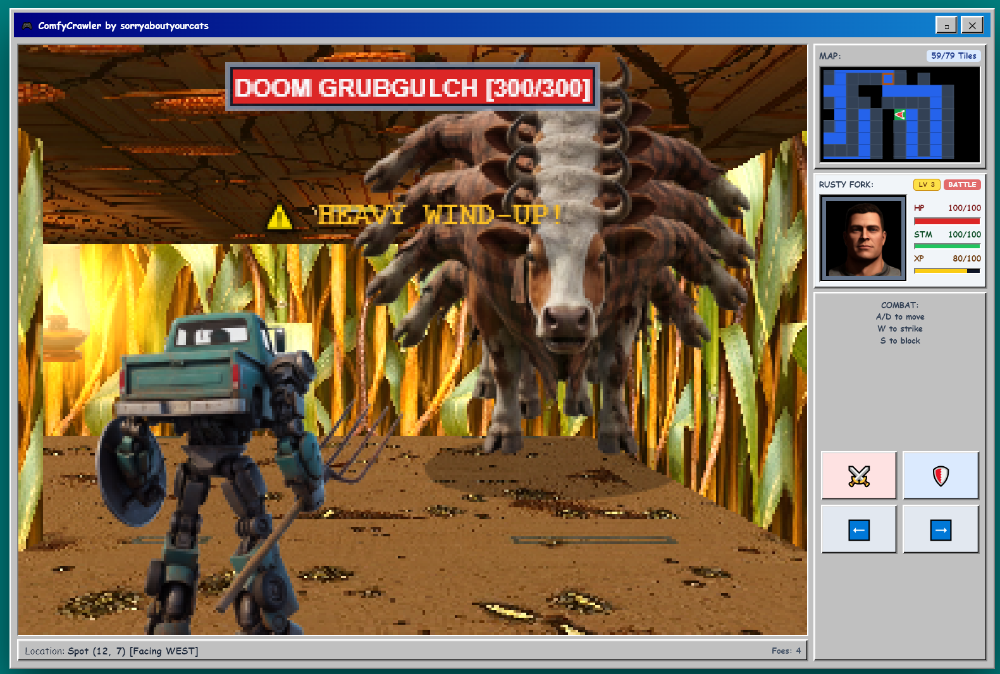
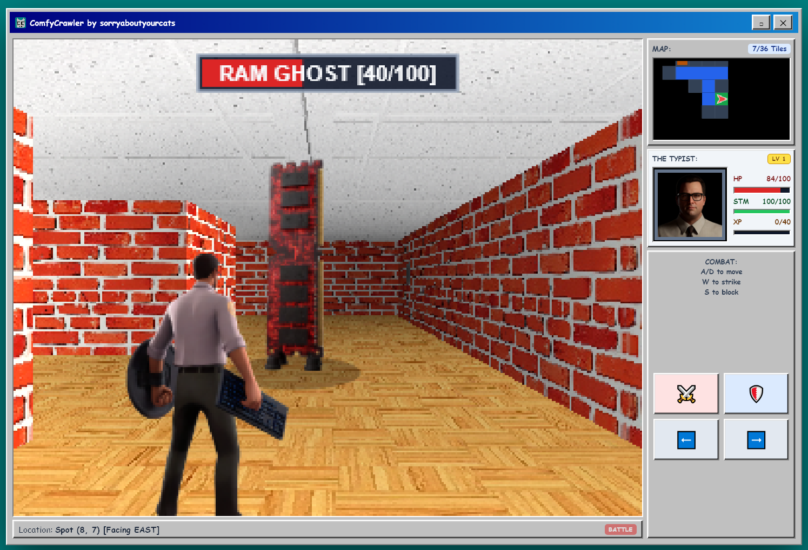
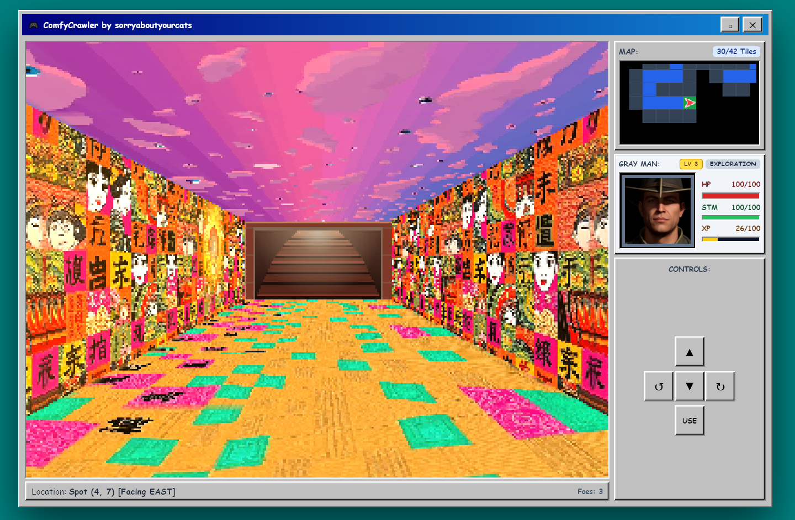
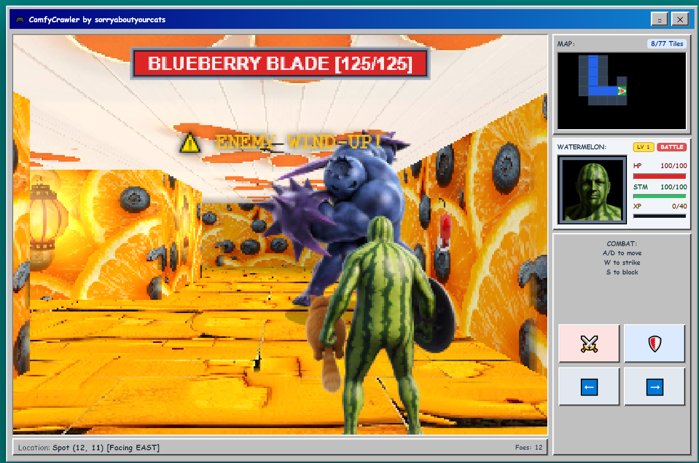
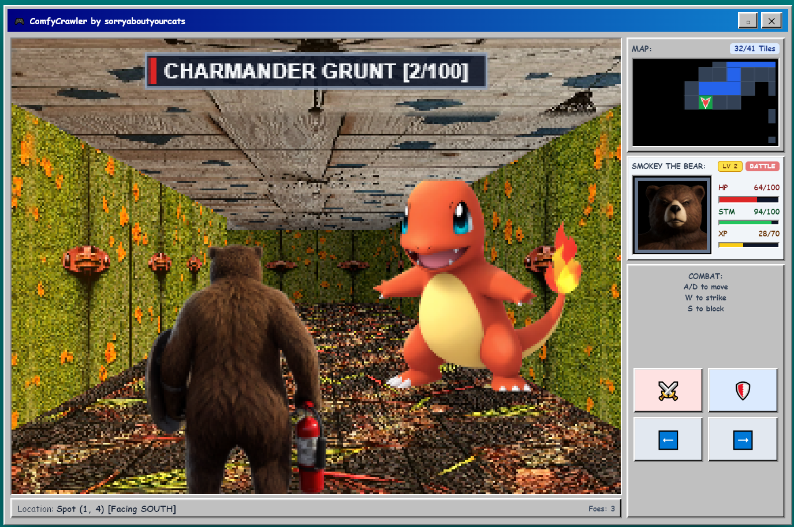
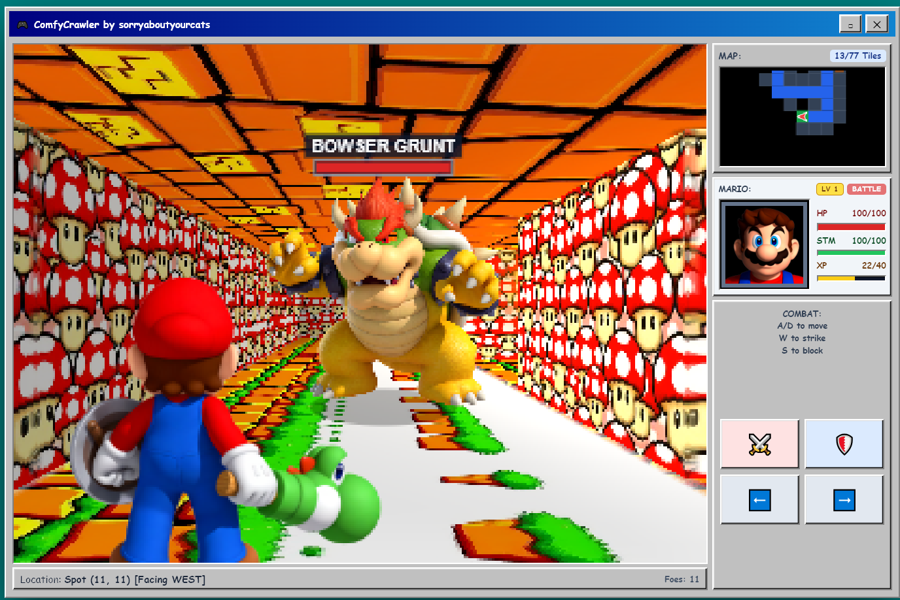
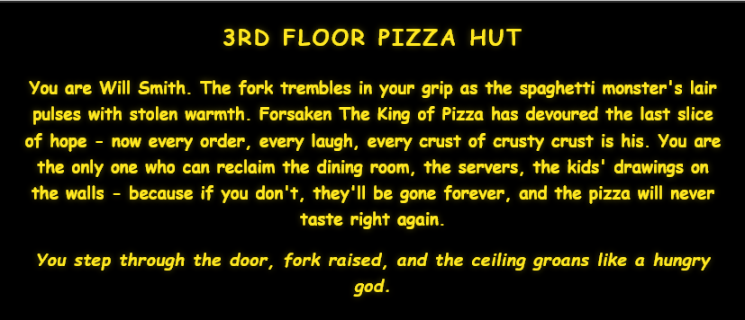
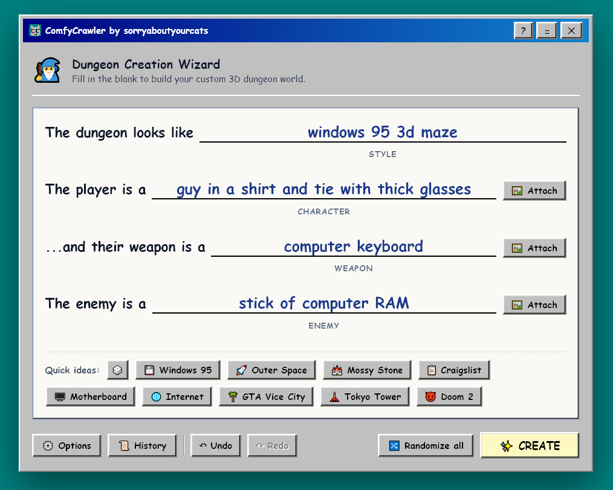
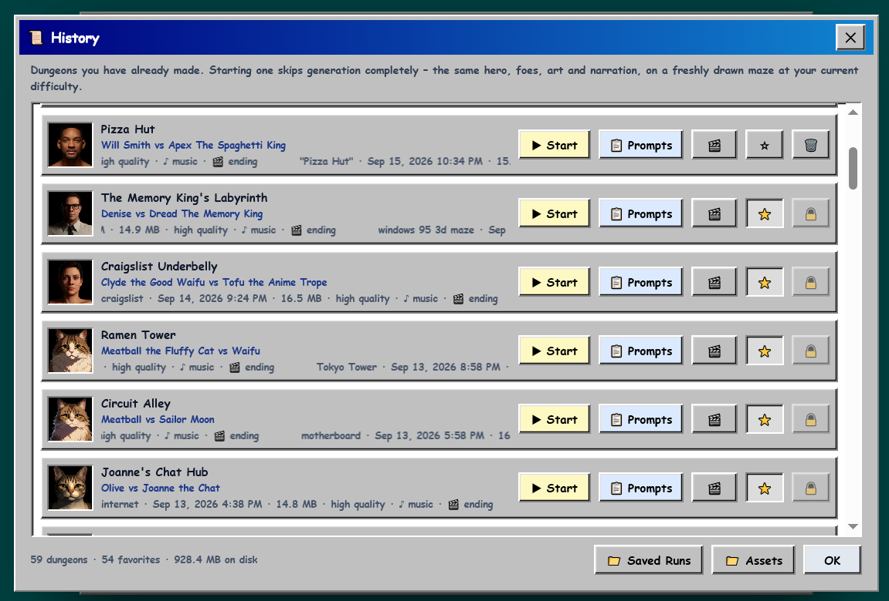

# 🏰 ComfyCrawler

**A Windows 95 3D Maze–style dungeon crawler that your own ComfyUI draws, scores and narrates.** Fill in four blanks - what the dungeon looks like, who you are, your weapon, your enemy - and ComfyUI builds the walls, the hero, the monsters, the boss, the music and the story. Then you walk in and fight your way to the boss.

**▶️ Play it in your browser, no install:** [mowmeow.net/ComfyCrawlerTest](https://mowmeow.net/ComfyCrawlerTest/). This is the read-only edition, with dungeons that were already made. AI agents: start at [mowmeow.net/ComfyCrawlerTest/?agent](https://mowmeow.net/ComfyCrawlerTest/?agent) and read [llms.txt](llms.txt).

**🎬 The 30-second trailers:** add `/trailer` or `/trailer2` to any ComfyCrawler address - [mowmeow.net/ComfyCrawlerTest/trailer](https://mowmeow.net/ComfyCrawlerTest/trailer/) and [/trailer2](https://mowmeow.net/ComfyCrawlerTest/trailer2/), or `127.0.0.1:5555/trailer` and `:8188/comfycrawler/trailer2` on your own machine. Each is the game itself, playing a hand-picked cast of saved dungeons (`trailer.json`, `trailer2.json`) to its own music track, cut on the beat - the first shows off what you can type, the second what fights back (a death, a monster parade and a boss charge). `/trailer11` is the first again with the hero side-stepping through its fights (`trailer11.json` just extends `trailer.json`), and `/trailer12` is the first with its end card reading "Try it out now: https://mowmeow.net/ComfyCrawlerTest" instead of buttons - the one to record. `/trailer12m` plays that same cut on a phone (a phone-sized frame, with the touch layout, touchpad and strafe slider).

[](LICENSE)
[](https://registry.comfy.org/nodes/comfycrawler)



---

## ✨ What you get

Everything below is generated for each dungeon, from what you typed:

* 🧱 **The dungeon** - wall, floor, ceiling, door, lantern and switch textures in your style (FLUX.1 [schnell]).
* 🦸 **Your hero** - a battle sprite with swing, block, hurt and walk frames (Krea 2 turbo), plus a HUD portrait that grimaces when you're hit (FLUX.1 Kontext).
* 👾 **Your foes** - walkers, flyers and a boss, each designed and named to fit the theme (Krea 2 turbo, Qwen3-VL).
* 📜 **A story** - a location, a cast of names and an opening crawl (Qwen3-VL), read aloud if narration is installed (Piper).
* 🔊 **Sound and music** - footsteps that match the floor, swings that match the weapon, and explore and battle music (Stable Audio 3). A victory song is picked by your dungeon's style.
* 🎬 **An ending cutscene** *(optional)* - the hero landing the final blow on the boss, filmed from the run's own characters, textures and music (MiniMax H3).

Then it's a game:

* **Explore** a grid maze in the style of the Windows 95 3D Maze screensaver, with a minimap. Throw switches to open locked gates.
* **Fight** in real time: dodge left and right, strike, and block (watch your stamina). Gain XP and level.
* **Beat the boss** and reach the stairs.
* **Replay** any dungeon from History - the same art and music on a freshly drawn maze.

## 🖼️ Screenshots

| | |
| :---: | :---: |
|  |  |
| *A Windows 95 maze: The Typist vs a RAM Ghost* | *Exploring toward the exit stairs* |
|  |  |
| *A fruit dungeon, mid wind-up* | *Named characters work too* |
|  |  |
| *Quoted names become that exact character* | *Every dungeon opens with its story* |
|  |  |
| *The Dungeon Creation Wizard* | *Replay a dungeon, reuse its prompts, watch its ending* |

---

## 🛠️ Requirements

* **ComfyUI 0.34.2 or newer**, on the same computer. Developed and tested on ComfyUI Desktop for Windows with an **NVIDIA RTX 3090**.
* **[ComfyUI-KJNodes](https://github.com/kijai/ComfyUI-KJNodes)** - required. Its SageAttention patch is also used automatically, when installed, to speed up the ending cutscene.
* **The models below.** ComfyCrawler checks for every file when it starts and on the setup screen, and can download whichever ones are missing straight into the right folder - so you don't have to find and place them by hand. Required and optional are shown separately, so you can start with just the required ones and add the rest (sound, music, the ending cutscene) later; finishing an optional group turns on the Option it unlocks by itself.

### Models

**Required - about 50 GB**

| File | Put it in `ComfyUI/models/…` | Size |
| :--- | :--- | ---: |
| [krea2_turbo_fp8_scaled.safetensors](https://huggingface.co/Comfy-Org/Krea-2/resolve/main/diffusion_models/krea2_turbo_fp8_scaled.safetensors) | `diffusion_models/` | 12.2 GB |
| [qwen3vl_4b_fp8_scaled.safetensors](https://huggingface.co/Comfy-Org/Krea-2/resolve/main/text_encoders/qwen3vl_4b_fp8_scaled.safetensors) | `text_encoders/` | 4.9 GB |
| [qwen_image_vae.safetensors](https://huggingface.co/Comfy-Org/Qwen-Image_ComfyUI/resolve/main/split_files/vae/qwen_image_vae.safetensors) | `vae/` | 0.2 GB |
| [flux1-schnell-fp8.safetensors](https://huggingface.co/Comfy-Org/flux1-schnell/resolve/main/flux1-schnell-fp8.safetensors) | `checkpoints/` | 16.1 GB |
| [birefnet.safetensors](https://huggingface.co/Comfy-Org/BiRefNet/resolve/main/background_removal/birefnet.safetensors) | `background_removal/` | 0.4 GB |
| [flux1-dev-kontext_fp8_scaled.safetensors](https://huggingface.co/Comfy-Org/flux1-kontext-dev_ComfyUI/resolve/main/split_files/diffusion_models/flux1-dev-kontext_fp8_scaled.safetensors) | `diffusion_models/` | 11.1 GB |
| [t5xxl_fp8_e4m3fn.safetensors](https://huggingface.co/comfyanonymous/flux_text_encoders/resolve/main/t5xxl_fp8_e4m3fn.safetensors) | `text_encoders/` | 4.6 GB |
| [clip_l.safetensors](https://huggingface.co/comfyanonymous/flux_text_encoders/resolve/main/clip_l.safetensors) | `text_encoders/` | 0.2 GB |
| [ae.safetensors](https://huggingface.co/Comfy-Org/Lumina_Image_2.0_Repackaged/resolve/main/split_files/vae/ae.safetensors) | `vae/` | 0.3 GB |

**Sound effects and music - 5.3 GB** *(optional: without them you get procedural sound effects and no music)*

| File | Put it in `ComfyUI/models/…` | Size | Used for |
| :--- | :--- | ---: | :--- |
| [stable_audio_3_small_sfx.safetensors](https://huggingface.co/Comfy-Org/stable-audio-3/resolve/main/checkpoints/stable_audio_3_small_sfx.safetensors) | `checkpoints/` | 2.1 GB | sound effects |
| [stable_audio_3_small_sfx_base.safetensors](https://huggingface.co/Comfy-Org/stable-audio-3/resolve/main/checkpoints/stable_audio_3_small_sfx_base.safetensors) | `checkpoints/` | 2.1 GB | music |
| [t5gemma_b_b_ul2.safetensors](https://huggingface.co/Comfy-Org/stable-audio-3/resolve/main/text_encoders/t5gemma_b_b_ul2.safetensors) | `text_encoders/` | 1.1 GB | both |

**Ending cutscene - 39.6 GB** *(optional: only needed with Options › Ending Video turned on)*

| File | Put it in `ComfyUI/models/…` | Size |
| :--- | :--- | ---: |
| [minimax_h3_ref2va_pruned_int8_convrot.safetensors](https://huggingface.co/Comfy-Org/MiniMax-H3/resolve/main/diffusion_models/minimax_h3_ref2va_pruned_int8_convrot.safetensors) | `diffusion_models/` | 19.5 GB |
| [qwen3vl_32b_minimax_h3_nvfp4_awq.safetensors](https://huggingface.co/Comfy-Org/MiniMax-H3/resolve/main/text_encoders/qwen3vl_32b_minimax_h3_nvfp4_awq.safetensors) | `text_encoders/` | 14.6 GB |
| [minimax_h3_video_vae_fp16.safetensors](https://huggingface.co/Comfy-Org/MiniMax-H3/resolve/main/vae/minimax_h3_video_vae_fp16.safetensors) | `vae/` | 4.9 GB |
| [minimax_h3_audio_vae_fp32.safetensors](https://huggingface.co/Comfy-Org/MiniMax-H3/resolve/main/vae/minimax_h3_audio_vae_fp32.safetensors) | `vae/` | 0.6 GB |

---

## 📦 Install

### From ComfyUI-Manager

Open **Manager › Custom Nodes Manager**, search for **ComfyCrawler**, install, and restart ComfyUI.

### By hand

```bash
cd ComfyUI/custom_nodes
git clone https://github.com/sorryaboutyourcats/ComfyCrawler.git
path/to/ComfyUI/python -m pip install -r ComfyCrawler/requirements.txt
```

Use the Python that runs ComfyUI (for ComfyUI Desktop, the one in its `.venv`), then restart ComfyUI.

### Play

Any of these opens the game:

* ComfyUI's menu › **ComfyCrawler › Open ComfyCrawler**
* the **ComfyCrawler** button in ComfyUI's top bar
* the **ComfyCrawler** panel in ComfyUI's sidebar
* **http://127.0.0.1:8188/comfycrawler/** (use your ComfyUI's port if it isn't 8188)

ComfyCrawler adds no nodes to the graph - it's a page ComfyUI serves. The sidebar panel shows what
your ComfyUI still needs, downloads any missing models, and can reload an updated ComfyCrawler
without restarting ComfyUI.

### Narration *(optional)*

The opening crawl is read aloud by [Piper](https://github.com/rhasspy/piper), which runs on the CPU. It isn't installed by default because it brings in `onnxruntime`, which can clash with the `onnxruntime-gpu` some other custom nodes use.

1. `path/to/ComfyUI/python -m pip install -r requirements-narration.txt` (from the ComfyCrawler folder)
2. Download both files of each voice into a `piper_voices` folder inside ComfyCrawler:
   * `en_GB-alan-medium` - [.onnx](https://huggingface.co/rhasspy/piper-voices/resolve/main/en/en_GB/alan/medium/en_GB-alan-medium.onnx) and [.onnx.json](https://huggingface.co/rhasspy/piper-voices/resolve/main/en/en_GB/alan/medium/en_GB-alan-medium.onnx.json)
   * `en_US-kristin-medium` - [.onnx](https://huggingface.co/rhasspy/piper-voices/resolve/main/en/en_US/kristin/medium/en_US-kristin-medium.onnx) and [.onnx.json](https://huggingface.co/rhasspy/piper-voices/resolve/main/en/en_US/kristin/medium/en_US-kristin-medium.onnx.json)
3. Restart ComfyUI.

### Standalone server *(instead of the custom node)*

ComfyCrawler can also run as its own small server beside a running ComfyUI:

```bash
git clone https://github.com/sorryaboutyourcats/ComfyCrawler.git
cd ComfyCrawler
pip install -r requirements.txt -r requirements-narration.txt
python server.py
```

Then open **http://127.0.0.1:5555**. On Windows, `start-server.bat` does the same and keeps the log window open.

ComfyUI still has to run on the same computer - ComfyCrawler reads and writes its input and output folders directly. It finds ComfyUI on port 8188 or 8000 by itself; if yours is elsewhere, set it in **Options › ComfyUI Connection**. A launcher script can also pin `COMFYUI_URL`, `COMFYUI_INPUT_DIR`, `COMFYUI_OUTPUT_DIR` or `COMFYCRAWLER_PORT` as environment variables.

---

## 🎮 Controls

| | Keyboard | On screen |
| :--- | :--- | :--- |
| **Exploring** | | |
| Move forward / back | <kbd>W</kbd> <kbd>S</kbd> or <kbd>↑</kbd> <kbd>↓</kbd> | ▲ ▼ |
| Turn left / right | <kbd>A</kbd> <kbd>D</kbd> or <kbd>←</kbd> <kbd>→</kbd> | ↺ ↻ |
| Use (throw a switch) | <kbd>Space</kbd> or <kbd>Enter</kbd> | USE |
| Menu | <kbd>Esc</kbd> | ✕ |
| **In battle** | | |
| Step aside | hold <kbd>A</kbd> / <kbd>D</kbd> or <kbd>←</kbd> / <kbd>→</kbd> | ⬅ ➡ |
| Strike | <kbd>W</kbd> or <kbd>↑</kbd> | ⚔️ |
| Block | hold <kbd>S</kbd> or <kbd>↓</kbd> | 🛡️ |

Every menu and window works from the keyboard too: arrow keys move the cursor, <kbd>Enter</kbd> picks, <kbd>Esc</kbd> backs out.

### 🤖 AI players

AI agents can play too. [llms.txt](llms.txt) is their manual: what the game is, the rules and numbers, a `window.ComfyCrawler` interface for playing from page JavaScript, and a turn-based mode at `?agent` (for example `http://127.0.0.1:5555/?agent`). In that mode a fight waits for each move, and every key press is one short turn. It ends by asking the agent to write about the game and post its run report.

## ⚙️ Options

* **Difficulty** - Easy, Medium or Hard: ~33, ~66 or ~111 corridors, with foes getting 25% or 60% more health on the harder two.
* **Texture and Sprite Generation** - High, Medium or Low generation resolution. Lower is faster.
* **Max Frame Rate** - 24 to 240 FPS.
* **Sound Generation** - music and sound, sound only, or none (fastest).
* **Ending Video** - film the ending cutscene (off by default; it adds several minutes).
* **Screensaver Wait** - how long before the starfield takes over.

Options are saved by ComfyCrawler itself, so they're the same whichever address you play from.

## 📜 History

Every dungeon you make is saved. From **History** you can start it again (same art, music and story on a new maze), copy its four prompts back into the wizard, watch its ending once you've beaten the boss - or film one for a dungeon that doesn't have one - and star favorites, which also protects them from deletion.

Saved dungeons live in ComfyUI's `user/comfycrawler/` folder when ComfyCrawler is installed as a node, and in `dungeon_sessions/` beside `server.py` for the standalone server.

A new install starts with an empty History, so History offers **📥 Get Sample Dungeons**: three finished dungeons (about 55 MB) downloaded from the [showcase site](https://mowmeow.net/ComfyCrawlerTest/) into that same folder, tagged SAMPLE. Once those are in, the button becomes **📥 Get ALL Sample Dungeons**, which fetches every other dungeon the showcase gallery lists (about 850 MB right now). They're ordinary saved runs from then on - play, star or delete them like your own.

---

## 🧑‍💻 Development

* **Tests** are plain scripts: `python tests/test_story_names.py`, and so on - each prints `all … checks passed` or exits non-zero. `tests/test_node_routes.py` needs `aiohttp`, so run that one with ComfyUI's Python.
* **Styles** are Tailwind 3.4.17, compiled into the committed `tailwind.css`. After adding a Tailwind class to `index.html` or `game.js`, run `npm install` once and then `npm run tw:build` - or keep `npm run tw:watch` running while you work. `tests/test_tailwind_fresh.py` catches a forgotten rebuild.
* **Layout:** `server.py` is the whole backend (generation pipeline and HTTP API); `index.html` and `game.js` are the whole game; `comfy_node.py` and `__init__.py` run the same server inside ComfyUI.

## 📄 License and credits

ComfyCrawler is [MIT licensed](LICENSE). The models it uses are not part of it and each has its own license - FLUX.1 Kontext [dev], for one, is non-commercial - so check them before using what you make commercially.

Made by **[sorryaboutyourcats](https://github.com/sorryaboutyourcats)** together with **Claude** (Anthropic), in Claude Code.
